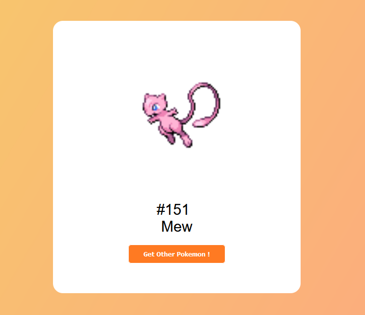
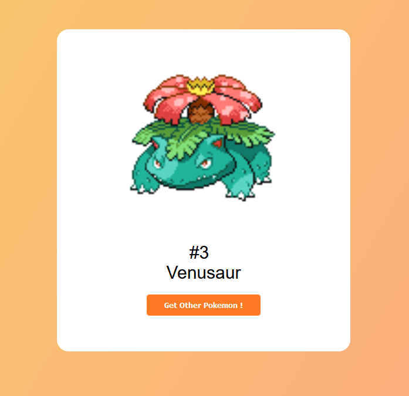
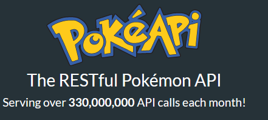

# PokeApi
🐱🦘🐻This project utilizes the PokeAPI to showcase each Pokemon's image and aims to explore the usage of an API.

if you want to test go to : [PokeRanki](https://raanki.github.io/PokeApi/) 
if you want to see PokeApi, go to : [PokeAPI](https://pokeapi.co/)

## Picture :

  

  

 
### Thank's to 
  

#### by @ranki
